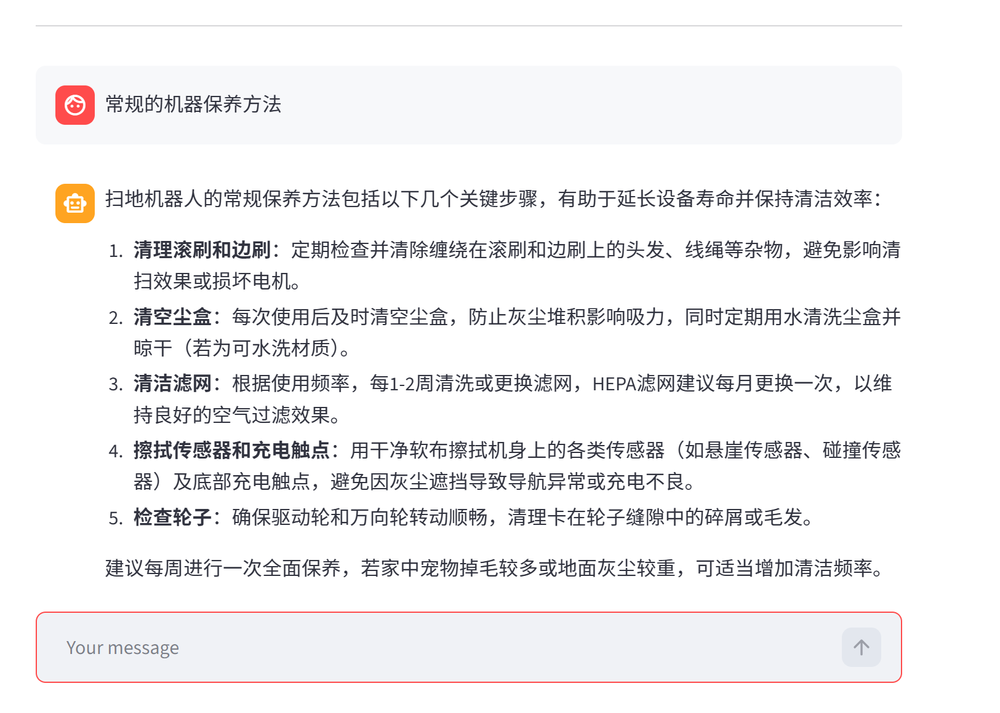
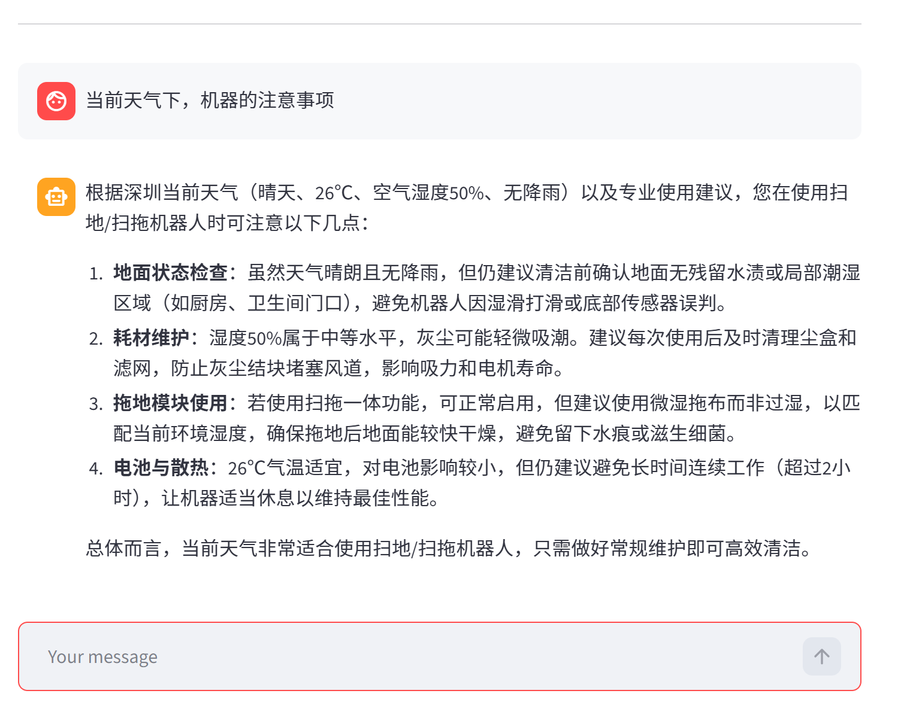
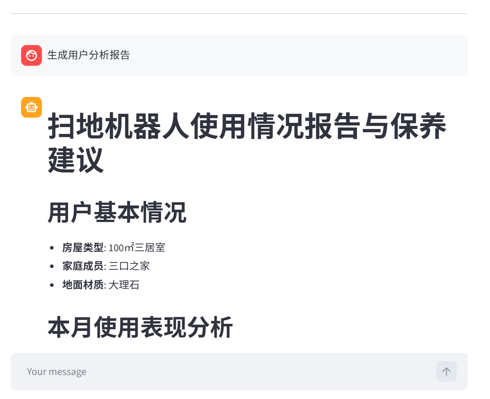

<div align="center">

# LangChain ReAct Agent · Smart Customer Support

**An intelligent customer support system powered by LangChain + ReAct paradigm + RAG retrieval-augmented generation, featuring a robotic vacuum cleaner use case**

[](https://www.python.org/)
&nbsp;
[](https://www.langchain.com/)
&nbsp;
[](https://github.com/langchain-ai/langgraph)
&nbsp;
[](https://streamlit.io/)
&nbsp;
[](./LICENSE)

</div>

---

## Overview

A **ReAct (Reasoning + Acting) Agent** built with the LangChain framework, integrating RAG retrieval-augmented generation, multi-tool calling, and dynamic prompt switching. The system autonomously determines user intent (knowledge QA vs. report generation), invokes the appropriate tools and knowledge bases for reasoning, and visualizes the Agent's thought process in real time via a Streamlit streaming interface.

## Demo

<div align="center">



*Figure 1. Q&A — RAG-powered knowledge base retrieval*

&nbsp;



*Figure 2. Agent Tool Calling — real-time reasoning and tool execution pipeline*

&nbsp;



*Figure 3. Tool Call Details — multi-step reasoning with intermediate results visualization*

</div>

## Architecture

<div align="center">

```
User Input (Streamlit)
      │
      ▼
┌─────────────────────────────────────────┐
│            ReAct Agent                   │
│                                          │
│  ┌──────────┐    ┌──────────────────┐   │
│  │ Thought  │───→│     Action       │   │
│  │(Reasoning)│   │(Tool Call / RAG) │   │
│  └──────────┘    └────────┬─────────┘   │
│       ↑                   │              │
│       └─── Observation ◄──┘              │
│                                          │
│   Middleware: Tool Monitoring · Dynamic  │
│              Prompt Switching           │
└─────────────────────────────────────────┘
      │                │              │
      ▼                ▼              ▼
┌──────────┐   ┌────────────┐  ┌──────────┐
│   RAG    │   │   Tools    │  │  Prompt  │
│  Chroma  │   │Weather/User│  │ Dynamic  │
│  Vector  │   │Data/Report │  │ Switch   │
│  Store   │   │            │  │ Manager  │
└──────────┘   └────────────┘  └──────────┘
```

</div>

### Core Features

| Feature | Description |
|---|---|
| **ReAct Paradigm** | Thought → Action → Observation loop; the Agent autonomously reasons and decides which tool to invoke |
| **RAG Retrieval** | Chroma vector store + local Embedding with MD5 file deduplication; supports TXT/PDF loading |
| **Multi-Tool Calling** | Weather lookup / user location / external data retrieval / report context injection; Agent auto-selects as needed |
| **Dynamic Prompt Switching** | Middleware auto-switches between "Q&A" and "Report Generation" system prompts based on runtime context |
| **Streaming UI** | Streamlit-powered, character-by-character streaming output, chat history, visible Agent reasoning |
| **Modular Architecture** | Agent / RAG / Model / Tools / Middleware as independent modules; YAML-driven configuration |

## Tech Stack

| Layer | Technology |
|---|---|
| LLM | Local Qwen (LM Studio / OpenAI-compatible API) |
| Agent Framework | LangChain + LangGraph |
| Vector Database | Chroma |
| Document Processing | PyPDF + RecursiveCharacterTextSplitter |
| Frontend | Streamlit |
| Configuration | YAML-driven (Agent / RAG / Chroma / Prompts) |

## Quick Start

### Requirements

- **Python** >= 3.10
- **LM Studio** (or any OpenAI-compatible local server) with a chat model and an embedding model loaded

### 1. Clone the Repository

```bash
git clone https://github.com/LL422/langchain-react-rag-agent.git
cd langchain-react-rag-agent
```

### 2. Install Dependencies

```bash
pip install -r requirements.txt
```

### 3. Configure LM Studio

- Download and install [LM Studio](https://lmstudio.ai/)
- Load a chat model (e.g., `qwen2.5-7b-instruct`) and an embedding model (e.g., `text-embedding-bge-small-en-v1.5`)
- Start the Local Server (default port: `1234`)
- Update model names in `config/rag.yml` if using different models

### 4. Initialize the Knowledge Base (First Run)

```bash
python -c "from rag.vector_store import VectorStoreService; VectorStoreService().load_document()"
```

### 5. Launch the Application

```bash
streamlit run app.py
```

Your browser will open automatically at http://localhost:8501

### Verification

Try these test queries after launching:

- *What are the main functions of a robotic vacuum cleaner?* (RAG knowledge base QA)
- *What should I do if the robot won't return to its charging dock?* (Troubleshooting)
- *Generate a personalized usage report based on my data* (Report generation + tool calling)

## Project Structure

```
LangChain-ReAct-Agent/
│
├── agent/                          # Agent Core
│   ├── react_agent.py              #   ReAct Agent main logic (streaming execution)
│   └── tools/
│       ├── agent_tools.py          #   Tool functions (RAG/Weather/User Data/Report)
│       └── middleware.py           #   Middleware (tool monitoring/dynamic prompt switching)
│
├── rag/                            # RAG Retrieval-Augmented Generation
│   ├── vector_store.py             #   Chroma vector store · document loading · MD5 deduplication
│   └── rag_service.py              #   RAG retrieval → LLM summarization service
│
├── model/
│   └── factory.py                  # Model factory (ChatTongyi + DashScopeEmbedding)
│
├── config/                         # YAML Configuration
│   ├── agent.yml                   #   Agent behavior & tool settings
│   ├── chroma.yml                  #   Vector store & retrieval parameters
│   ├── prompts.yml                 #   Prompt template paths
│   └── rag.yml                     #   RAG model & parameters
│
├── prompts/                        # Prompt Templates
│   ├── main_prompt.txt             #   Q&A System Prompt
│   ├── rag_summarize.txt           #   RAG Summarization Prompt
│   └── report_prompt.txt           #   Report Generation System Prompt
│
├── utils/                          # Utilities
│   ├── config_handler.py           #   YAML config loader
│   ├── file_handler.py             #   File parsing (PDF/TXT)
│   ├── logger_handler.py           #   Logging
│   ├── path_tool.py                #   Path utilities
│   └── prompt_loader.py            #   Prompt loader
│
├── data/                           # Knowledge base documents (robotic vacuum domain)
│   └── external/                   # External data (usage records)
├── assets/                         # Demo screenshots
├── app.py                          # Streamlit application entry point
├── requirements.txt
└── README.md
```

## Configuration

All settings are managed through YAML files in the `config/` directory:

| File | Description |
|---|---|
| `rag.yml` | Chat model name, Embedding model name |
| `chroma.yml` | Chroma persistence path, chunk size, retrieval Top-K, supported file types |
| `prompts.yml` | Prompt template file paths for each scenario |
| `agent.yml` | Agent timeout, external data path, etc. |

For first-time setup, make sure LM Studio is running with both models loaded and knowledge base documents are present in the `data/` directory.

## License

This project is licensed under the [MIT License](./LICENSE).
